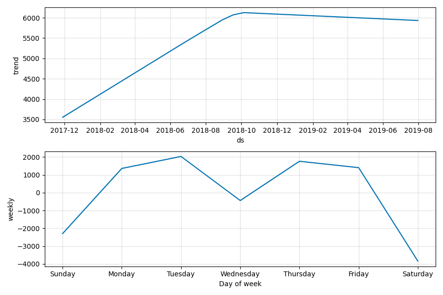
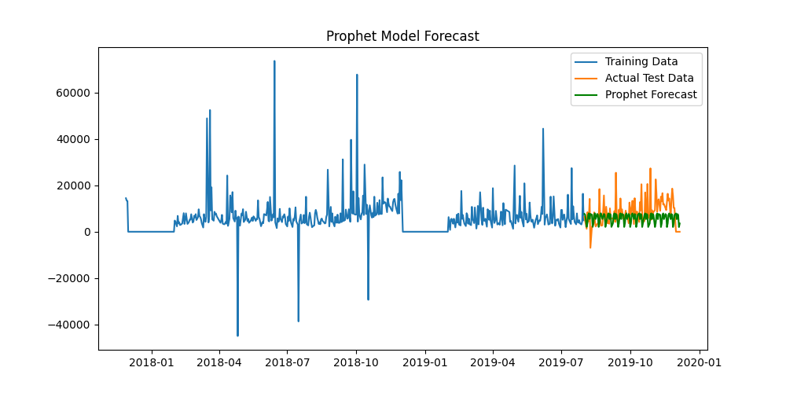
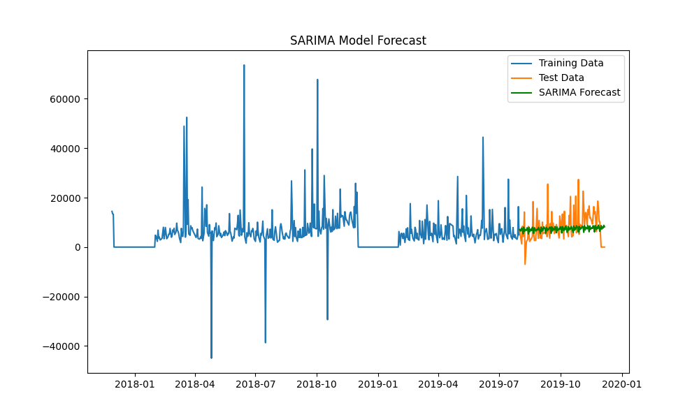
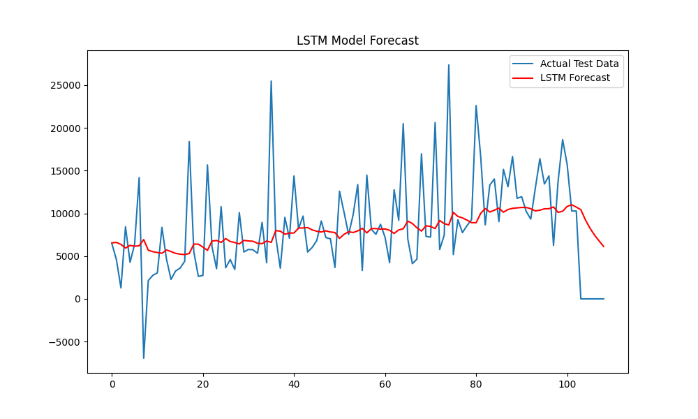
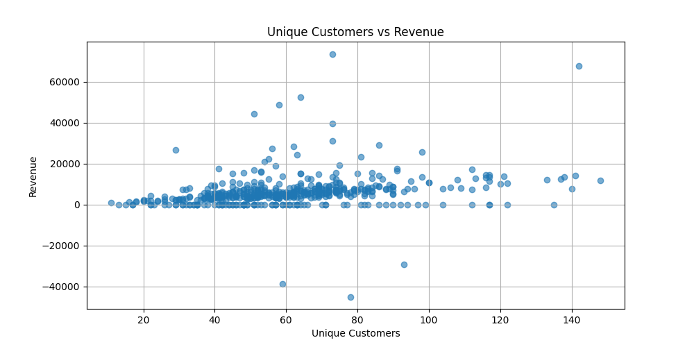
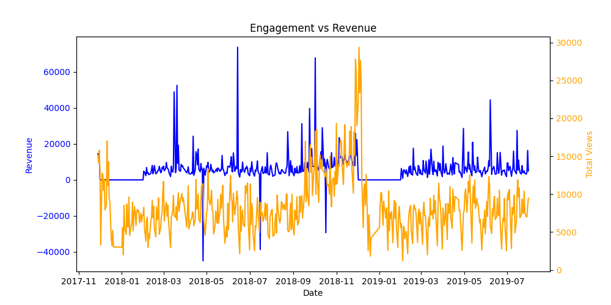
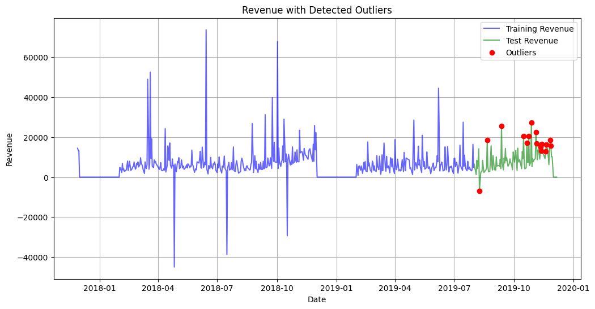

# IBM AI Enterprise Workflow Capstone Project

## Overview

This project is a capstone for the IBM AI Enterprise Workflow specialization. The main goal is to demonstrate an end-to-end data science project focusing on time-series analysis and forecasting for a business opportunity. The project is divided into three major parts: data understanding and preparation, modeling and evaluation, and API development and deployment.

## Project Structure

The project is organized into three parts:

### Part 1: Data Understanding and Preparation

- **Assimilate Business Scenario and Testable Hypotheses**: We began by understanding the business opportunity and defining hypotheses that can be tested using data. The objective was to identify key patterns and relationships that could inform business decisions.
  - **Testable Hypotheses**: We formulated hypotheses such as "Does increased customer engagement lead to higher revenue?" and "Is there a seasonal pattern in revenue generation that can be leveraged for strategic planning?" These hypotheses were designed to validate the relationship between key business metrics and data features.
  - **Business Opportunity Restatement**: The business opportunity is to leverage time-series analysis to forecast future revenue, identify trends, and optimize business strategies. We aim to use historical data to understand customer behavior and seasonality to make informed business decisions.

- **Ideal Data Identification**: Before starting data ingestion, we specified the types of data that would be ideal for addressing the business problem, such as transaction records, customer engagement metrics, and seasonal sales data. This helped provide context for building the feature matrix and targets for modeling.
  - **Rationale for Data Selection**: Transaction records help understand revenue patterns, customer engagement metrics provide insight into customer behavior, and seasonal sales data helps capture temporal trends. These data types are crucial for building a robust forecasting model.
  - **Data Sources**: Data was sourced from CRM systems for customer engagement, sales databases for transaction records, and external seasonal data for capturing temporal variations. This combination of sources ensured comprehensive coverage of relevant business metrics.

- **Data Ingestion**: Python scripts were created to extract relevant data from multiple sources. We automated data ingestion, ensuring that data was properly formatted, cleaned, and transformed into a usable form for exploratory data analysis (EDA) and modeling.
  - **Data Quality Checks**: During ingestion, we implemented data validation methods to catch common input errors, such as missing values and non-uniform feature naming. This ensured the quality and consistency of the dataset.
  - **Data Ingestion Script**: A Python module was developed with functions to read data from multiple sources, handle missing values, and standardize feature names. The script ensures data is ready for EDA and modeling.
  - **Handling Missing Values**: Missing values were handled using appropriate imputation methods, such as forward filling for time-series continuity and median imputation for numerical features.

- **Relationship Investigation**: Using EDA tools, we explored the relationships between features, target variables, and the business metric. This helped in understanding key data patterns and correlations.
  - **Aggregation for Time-Series**: We aggregated the transactions by day to prepare the data for time-series modeling, which allowed us to capture temporal trends effectively.
  - **EDA Techniques**: Correlation analysis, time-series decomposition, and visualizations such as histograms and scatter plots were used to investigate relationships between variables.
  - **Correlation Findings**: We found that unique customer counts had a moderate positive correlation with revenue, while engagement metrics showed varying levels of impact on revenue depending on the quality of customer interaction.

- **Visualization of Findings**: The findings from EDA were articulated through visualizations to highlight trends, seasonality, and outliers in the data.

  

  - **Seasonality Components**: The figure above shows how weekly variations influence revenue, peaking around mid-week and showing declines over weekends. These insights inform decisions such as when to run promotions.

### Part 2: Modeling and Evaluation

- **Modeling Approaches**: Multiple time-series modeling approaches were evaluated, including Prophet, SARIMA, and LSTM models. Each approach was tested to see how well it could forecast future revenue.

  
  
  

  - **Prophet Model Forecast**: The graph above demonstrates the trend and seasonality patterns learned by the Prophet model, effectively capturing overall trends but showing overfitting for weekends.
  - **SARIMA Model Forecast**: This model handled seasonality well, particularly capturing repeating weekly patterns, but struggled with noise.
  - **LSTM Model Forecast**: The LSTM model was used to capture long-term dependencies, which helped with predicting complex trends, despite higher RMSE compared to SARIMA.

- **Model Iteration and Refinement**: We iteratively improved the models by modifying data transformations, feature engineering techniques, pipeline architectures, and hyperparameters. Examples include adjusting the seasonality parameters for Prophet, tuning the order parameters for SARIMA, and modifying the LSTM architecture to better capture dependencies.
  - **Feature Engineering**: Features such as revenue lag, rolling averages, and interaction terms were engineered to enhance model performance. Recursive forecasting was also explored to extend the forecasting horizon.
  - **Hyperparameter Tuning**: Hyperparameters were optimized using grid search for SARIMA and Bayesian optimization for LSTM, resulting in improved performance metrics.

- **Training and Deployment Preparation**: The best performing model was retrained on all available data in preparation for deployment.

- **Summary of Findings**: A summary report was created to articulate model performance, highlighting each model's strengths, weaknesses, and the final model chosen for deployment.

  #### Model Comparison Summary

  | Model   | RMSE       | MAPE                                      | Comment                         |
  |---------|------------|------------------------------------------|---------------------------------|
  | Prophet | 7264.72    | 423223394076085780480.00%                | Captured trend well but overfitted weekends. |
  | SARIMA  | 6211.37    | 58.23%                                   | Good with seasonality but struggled with noise. |
  | LSTM    | 7361.26    | 45.38%                                   | Best performance, captured long-term dependencies.|

  #### Summary of Key Findings
  - **Prophet Model**: Captured the overall trend effectively but showed limitations with weekend seasonality overfitting.
  - **SARIMA Model**: Handled seasonality well but struggled with high variability in the dataset.
  - **LSTM Model**: Best captured the long-term dependencies in data but at the cost of slightly higher RMSE.
  - The **Tuned Prophet Model** attempted to refine seasonal overfitting by adding more nuanced features, resulting in slightly lower performance metrics.

### Part 3: API Development and Deployment

- **API Development**: We built an API using Flask that includes endpoints for training the model (`/train`), making predictions (`/predict`), and retrieving logs (`/logfile`). This allows for easy integration and testing of the model with new data.
  - **Integration with Business Use-Cases**: The API was designed to provide revenue forecasts that can be used for strategic decision-making, such as budget planning and inventory management.
  - **Unit Tests**: Unit tests were created for each API endpoint to ensure reliability. The `/train` endpoint tests model training on different datasets, while `/predict` tests for correct input handling and response format.
  - **Error Handling**: The API includes error handling for invalid inputs, such as incorrect date formats or missing parameters, ensuring robustness in real-world usage.

- **Dockerization**: The model, API, and unit tests were bundled into a Docker container to ensure consistent and scalable deployment. This also allows for rapid re-deployment if updates are required.
  - **Docker Setup**: The Docker image includes all dependencies, and the containerized application can be deployed on any platform supporting Docker, ensuring consistent results across environments.

- **Test-Driven Development and Monitoring**: We used a test-driven development approach, iterating on the API while considering scale, load, and data drift. A monitoring script was implemented to analyze the relationship between model performance and the business metric, allowing us to track changes and retrain the model as necessary.
  - **Monitoring for Data Drift**: The monitoring component continuously tracks model predictions versus actuals, providing alerts if performance deviates significantly, indicating potential data drift.
  - **Post-Production Analysis**: A post-production analysis script was developed to investigate the relationship between model performance and business metrics over time, enabling proactive model retraining.
  - **Gold Standard Comparison**: Model results were compared to industry benchmarks to assess performance and ensure the model met business standards.

## Time-Series Analysis and Modeling

This project employs different time-series analysis tools and techniques, including:

- **Prophet**: A widely-used package for forecasting that captures seasonality and trends. It was used for modeling and to understand the underlying trends in the data.
- **SARIMA**: A seasonal version of ARIMA used to model complex seasonality in the data. It provided competitive forecasting accuracy.
- **LSTM**: A deep learning-based model used for sequence prediction. It was employed to capture long-term dependencies in the time-series data.

#### Advanced Methods Considered

- **Recursive Forecasting**: Extending the forecasting horizon by appending predictions to the input feature set.
- **Ensemble Forecasting**: Using multiple models to predict future points and combining their predictions.

## Key Visualizations

The following visualizations were generated during the project:

- **Prophet Model Forecast**: Demonstrates the trend and seasonality patterns learned by the Prophet model.
  
  

- **Seasonality Components**: Shows the trend and weekly seasonality components identified in the time-series data.
  
  

  - The figure above shows how weekly variations influence revenue, peaking around mid-week and declining on weekends. This insight can be used for strategic planning, such as scheduling promotions during peak days.

- **Customer vs Revenue**: Highlights the relationship between unique customers and revenue.
  
  

  - The scatter plot indicates a positive correlation between unique customers and revenue, suggesting that increased customer acquisition leads to higher revenue. However, outliers indicate that there are cases where revenue drops despite customer numbers, which could be due to factors like discounts or low-value purchases.

- **Engagement vs Revenue**: Plots engagement metrics like total views against revenue to understand their interaction.
  
  

  - The graph above shows that higher engagement does not always translate into higher revenue, indicating the need to analyze engagement quality and customer intent.

- **Outlier Detection**: Displays revenue data points identified as outliers, helping refine model training by addressing anomalies.
  
  

  - Outliers were detected and addressed to prevent skewed model training. Revenue spikes and dips were carefully analyzed to ensure the models were robust against such anomalies.

## Running the Project

1. **Data Ingestion**: Run the `data_processing.py` script to ingest and preprocess data from JSON files.
2. **Model Training**: Use the `main.py` script to train different time-series models (`Prophet`, `SARIMA`, `LSTM`). Hyperparameters can be adjusted within the script.
3. **API Deployment**: Deploy the Flask API using `app.py`. You can use Docker to containerize the app.
4. **API Endpoints**:
   - `/train`: Trains the model on the available dataset.
   - `/predict`: Takes a date range and returns the forecasted values.
   - `/logfile`: Retrieves model training logs.

### Example Commands

- **Train the Model**:
  ```bash
  curl -X POST http://127.0.0.1:5000/train
  ```
- **Get Predictions**:
  ```bash
  curl -X POST http://127.0.0.1:5000/predict -H "Content-Type: application/json" -d '{"start_date": "2024-01-01", "end_date": "2024-01-31"}'
  ```

## Files and Folders

- **`data_processing.py`**: Handles data ingestion, cleaning, and preparation.
- **`modeling.py`**: Contains functions for training different models like `Prophet`, `SARIMA`, and `LSTM`.
- **`app.py`**: Flask API implementation for model deployment and prediction.
- **`main.py`**: Script for orchestrating model training and evaluation.
- **`evaluation.py`**: Used for evaluating model performance and visualizing results.
- **Visualizations**: Included for better understanding of time-series trends, seasonality, model predictions, and outliers.

## Technologies Used

- **Python**: Primary language for all modeling, data processing, and API development.
- **Flask**: Used for building the REST API for training and prediction.
- **Docker**: Containerization of the API for easy deployment.
- **Prophet, SARIMA, LSTM**: Time-series modeling libraries.
- **pandas, NumPy, matplotlib**: Used for data manipulation and visualization.

## Next Steps

- **Hyperparameter Tuning**: Further refine model performance by optimizing hyperparameters.
- **Additional Features**: Explore additional features that could be used to improve the forecasting accuracy.
- **Production Deployment**: Deploy the API on a cloud platform such as AWS, GCP, or Azure.
- **Monitoring and Retraining**: Implement automated retraining based on model drift detection to ensure long-term accuracy.
- **Gold Standard Comparison**: Compare the model results to an industry benchmark to assess the relative performance.

## Conclusion

This project provides an end-to-end demonstration of a data science workflow—from data collection and analysis to modeling, evaluation, and deployment—focusing on time-series forecasting to address a real business opportunity. It highlights the iterative process of refining data and models and demonstrates how to operationalize machine learning models with an API-based approach. The key findings from this project provide valuable insights into the behavior of revenue over time, and the developed models can help make informed business decisions.

- **Business Impact**: The forecasts can assist in inventory management, budgeting, and planning promotions based on expected revenue peaks.
- **Deployment Readiness**: The model is ready for production deployment with continuous monitoring to maintain performance in dynamic environments.

